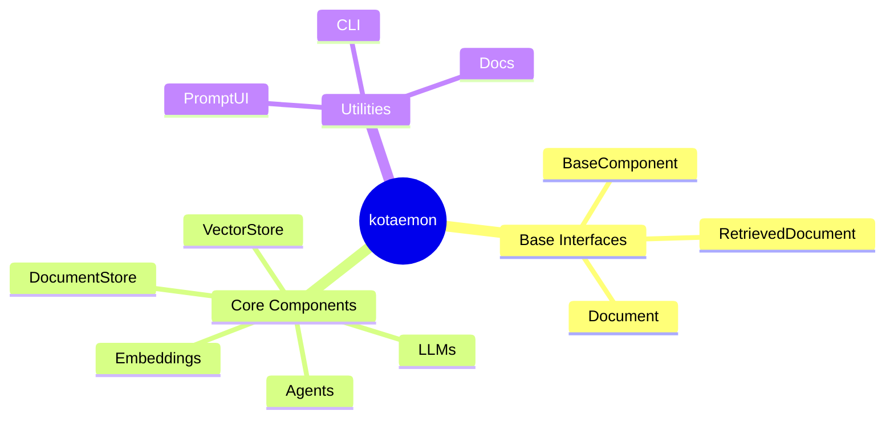

# Contributing

## Setting up

Clone this repository (not necessarily the upstream monorepo layout):

```shell
git clone <your-fork-url>
cd kotaemon
```

Install from the **repository root**:

```shell
python -m venv .venv
source .venv/bin/activate    # Windows: .venv\Scripts\activate

pip install -r requirements_gerageragera39.txt
pip install -e ".[dev]"
```

Python **3.11+** is required (`pyproject.toml` → `requires-python >= 3.11`).

Legacy upstream installers (`scripts/run_windows.bat`, `run_linux.sh`, …) install from `libs/kotaemon` on GitHub. **They do not match this fork.** Use `pip install -e .` here.

### Pre-commit

```shell
pre-commit install
pre-commit run --all-files
```

Hooks include black, isort, flake8, autoflake, mypy, codespell (see `.pre-commit-config.yaml`).

### Tests

```shell
pytest tests
```

Run from the repo root. CI in `.github/workflows/unit-test.yaml` may still reference `libs/kotaemon` — if CI fails, align the workflow with `pytest tests` and Python 3.11.

## Package overview

**`kotaemon`** — AI building blocks for RAG:

- **Base interfaces** — `BaseComponent`, pipeline composition via theflow
- **Core components** — LLMs, embeddings, vector/doc stores, retrievers, QA, agents
- **Utilities** — PromptUI, `kotaemon` CLI, doc generation, cookiecutter `start-project`

**`ktem`** — Gradio application that wires components via `flowsettings.py`, SQLite, and managers for LLMs/embeddings/rerankings.



## Conventions

- **PR title:** one-line summary (e.g. `Fix: align mkdocs path with src layout`).
- **PR body:** short description for reviewers and squash-merge message.
- Components use `kotaemon.base.BaseComponent`; config dicts use `"__type__": "dotted.path.Class"`.
- App settings use `KH_*` prefix in `flowsettings.py`.

## CI and caching

- PR environments may be cached by version in package metadata.
- To force a fresh CI environment, include `[ignore cache]` in the commit message (if your workflow supports it).
- Bump version in `pyproject.toml` when dependency pins change materially.

## Merge guideline

- Prefer **squash and merge**
- First line = PR title; body = PR description
